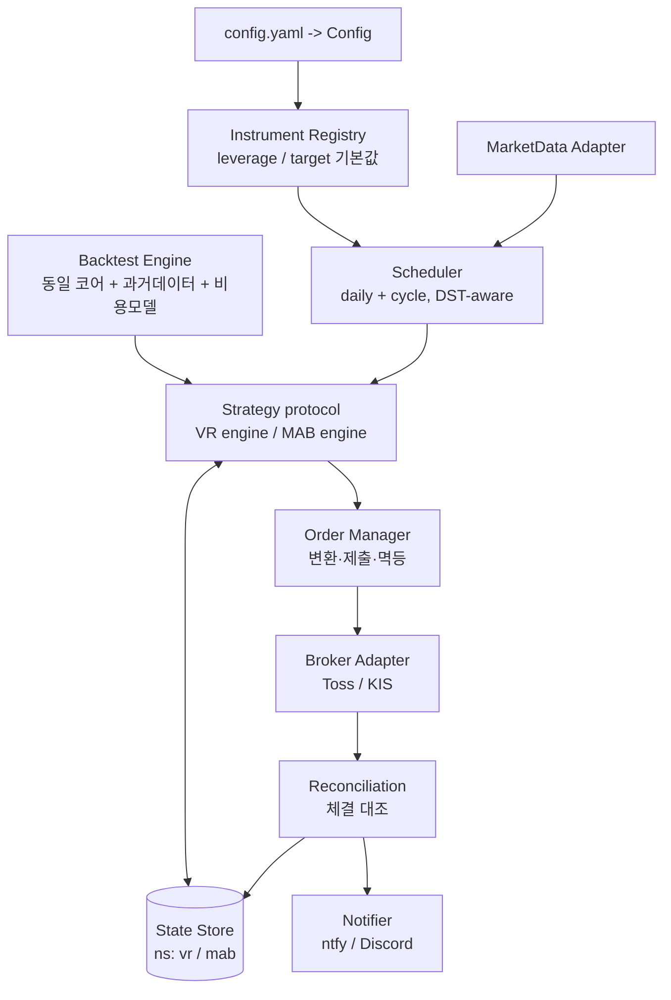

# ballast - System Architecture

## Overall Design Pattern

**포트-어댑터(Hexagonal) + 순수 함수 코어.**

- 전략 코어(VR/MAB)는 **IO 없는 순수 함수** — 같은 코드로 백테스트와 라이브를 모두 구동한다.
- 브로커·시세는 **어댑터 인터페이스**(Port)로 추상화 — Toss ↔ KIS 교체 가능.
- 두 전략은 공통 `Strategy` 프로토콜을 따르되, **각자 cadence(daily/cycle)와 state namespace**를 가진다.
- 종목·레버리지 배수는 **instrument registry**에서 주입되는 1급 파라미터.

## Layers and Interactions

## Core Modules

### Domain Core (순수 함수 — IO 없음)
- Location: `src/ballast/core/` (`vr.py`, `mab.py`, `models.py`, `instrument.py`)
- Responsibilities:
  - VR: `next_value`, `rebalance_decision`, `order_from_decision`.
  - MAB: `mab_daily_orders`, `mab_on_seed_exhausted`.
  - 공통 도메인 타입: `Order`, `Decision`, `Market`, `State`, `InstrumentMeta`.
  - Instrument 가드레일: `validate_instrument` (leverage<2·비지수추종 경고/차단).
- Technologies: Python 3.11+, `Decimal`(금액·수량), `pydantic`(검증), `Protocol`(Strategy).

### Adapters / Infrastructure (IO 경계)
- Location: `src/ballast/adapters/` (broker: `toss.py`/`kis.py`, market data, notifier)
- Responsibilities: 인증·잔고·평단·예수금·현재가·환율·장운영시간·주문 생성/정정/취소·체결 조회.
- Technologies: REST(httpx), OAuth2 Client Credentials, 환경변수 기반 시크릿.

### Application / Orchestration
- Location: `src/ballast/app/` (`scheduler.py`, `order_manager.py`, `reconciliation.py`, `state_store.py`, `config.py`)
- Responsibilities: 두 cadence 스케줄링(DST-aware), 의사결정→주문 변환·멱등 제출, 체결 대조→상태 갱신, Config 로딩/검증.
- Technologies: pydantic-settings, 파일/경량 DB 기반 State Store.

### Backtest Engine
- Location: `src/ballast/backtest/` (`engine.py`, `costs.py`, `baselines.py`, `sweep.py`)
- Responsibilities: 과거 일봉 OHLC + 동일 코어 함수 호출 + 비용 모델(수수료·양도세 22%·환율·슬리피지), 배수별 베이스라인, 파라미터 스윕(walk-forward·레짐 분할).
- Technologies: pandas/numpy, 재현 가능한 시뮬레이션.

### CLI / Entry
- Location: `src/ballast/cli.py`
- Responsibilities: `backtest`, `sweep`, `dry-run`, `live`(가드 ON) 서브커맨드.

### Tests
- Location: `tests/` (`unit/`, `integration/`) — 코어 순수 함수는 결정적 단위 테스트, 어댑터는 계약/통합 테스트.

# External Integrations

## Third-party Services
- **토스증권 Open API** (`developers.tossinvest.com/docs`): OAuth2, REST. 시세·잔고·주문·체결. `X-Tossinvest-Account`로 전략별 계좌 분기.
- **KIS Open API** (대안/MAB 폴백): LOC/MOC 지원 — 토스가 LOC 미노출 시 MAB 라이브용.
- **Notifier**: ntfy / Discord (알림). BurntToast 환경 보유.

# Traceability

## SPEC to Code Mapping
- TAG 시스템으로 SPEC↔코드↔테스트를 연결한다: `@SPEC:<ID>` → `@TEST:<ID>` → `@CODE:<ID>` → `@DOC:<ID>`.
- 각 SPEC 디렉터리(`.moai/specs/SPEC-<ID>/`)가 구현 모듈과 1:N 매핑.

## Change Tracking
- 모든 변경은 SPEC을 출발점으로 한다(SPEC-First DDD). 커밋은 conventional commits.

## TAG System
- `@SPEC` 요구사항 / `@TEST` 검증 / `@CODE` 구현 / `@DOC` 문서. grep 가능한 앵커로 추적성 확보.

---

*Last updated: 2026-06-26*
*Version: 0.1.0*
